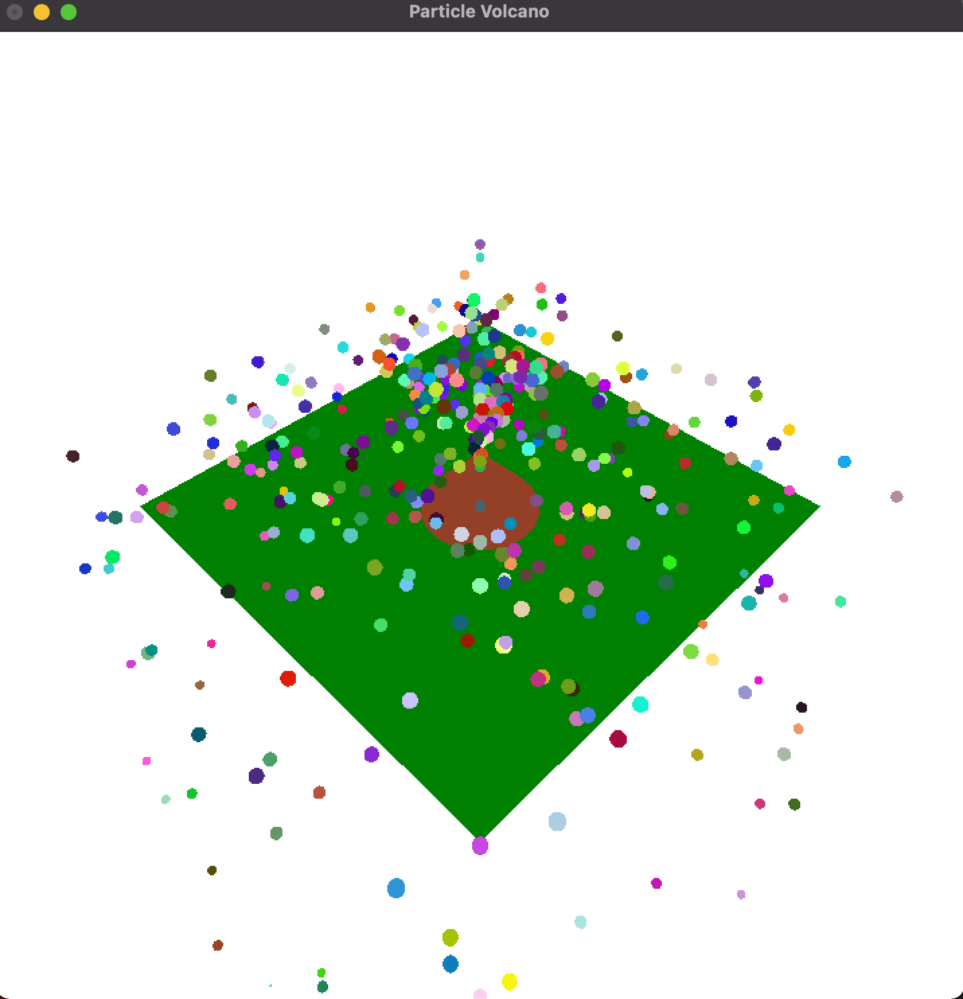

# Particle Cannon

3d particle cannon using OpenGL and C++.

**to build** 👉 g++ -framework OpenGL -framework GLUT -o cannon cannon.cpp <br>
**to run** 👉 ./cannon

## Modes 
- **Q**: Quit
- **R**: Reset
- **F**: Manual Firing
- **O**: Single Shot
- **K**: Spin
- **M**: Friction
- **L**: Lighting
- **C**: Culling
- **B**: Bouncy

## Code
```cpp
using namespace std;
#ifdef __APPLE_CC__
#include <GLUT/glut.h>
#else
#include <GL/glut.h>
#endif
#include <stdio.h>
#include <stdlib.h>
#include <vector>
#include <iostream>
#include <math.h>
#include <sys/types.h>
#include <sys/timeb.h>
#include <time.h>

// Cameron Cronheimer 
// Aman Braich 
// g++ -framework OpenGL -framework GLUT -o cannon cannon.cpp
// ./cannon

int redrawRate = 60;

bool stream = true;
bool spray, randomSpeed, light, friction, size, spin, cull, bouncy, lightShow;

int leftEdge = -20;
int rightEdge = 20;

// the particle object
struct particle
{
	// position
	double x, y, z;
	// acceleration
	double ax, ay, az;
	double dax, day, daz;
	// velocity
	double vx, vy, vz;
};

vector<particle> particles; // particles models

void createParticle()
{
	particle p; // particle object reference

	p.x = 0;
	p.y = 6; //starting pos (tip of the cannon)
	p.z = 0;

	// default speed (velocity)
	// "velocity is the direction the particle is going"
	p.vx = -10 + (rand() % 20); // -10 to 10
	p.vz = -10 + (rand() % 20);
	p.vy = 35; // constant y

	// acceleration
	float gravity = 60; // high gravity so we can have a high velocity

	// spin mode
	// simulates spinning by adjusting acceleration
	if (spin)
	{
		p.ax += -180 + (rand() % 360); // offset spin + increment thats updated in the loop
		p.ay = -gravity;
		p.az += -180 + (rand() % 360);
	}
	else
	{
		p.ax = 0;
		p.ay = -gravity;
		p.az = 0;
	}

	// random randomSpeed
	if (randomSpeed)
	{
		p.vx *= -10 + (rand() % 20); // -10 to 10
		p.vz *= -10 + (rand() % 20); // -10 to 10
	}

	particles.push_back(p);
}

void initDisplay(void)
{
	glMatrixMode(GL_MODELVIEW);
	glMatrixMode(GL_PROJECTION);
	glLoadIdentity();

	gluPerspective(60.0f, 1.0f, 1.0f, 100.0f); // perspective camera 60
	gluLookAt(35, 50, 35, 0, 0, 0, 0, 1, 0);   // move camera
}

void draw()
{
	initDisplay();

	glClear(GL_COLOR_BUFFER_BIT);

	// lighting
	if (light)
	{
		glEnable(GL_LIGHTING);
		glEnable(GL_LIGHT0);
	}
	else
	{
		glDisable(GL_LIGHTING);
		glDisable(GL_LIGHT0);
	}

	// culling
	if (cull)
	{
		glEnable(GL_CULL_FACE);
		glCullFace(GL_BACK);
		glFrontFace(GL_CW);
	}
	else
	{
		glDisable(GL_CULL_FACE);
	}

	// the floor
	glBegin(GL_POLYGON);
	glNormal3d(0, 0, 1);
	glColor3f(0.0, 0.5, 0.0); // green floor
	glVertex3f(leftEdge, 1, leftEdge);
	glVertex3f(leftEdge, 1, rightEdge);
	glVertex3f(rightEdge, 1, rightEdge);
	glVertex3f(rightEdge, 1, leftEdge);
	glEnd();

	glColor3f(0.58f, 0.25f, 0.15f); // volcano colour
	glPushMatrix();					// saves
	glTranslatef(0, 1.0f, 0);
	glRotatef(270.0f, 1.0f, 0, 0);
	glutSolidCone(5, 6, 20, 20); // volcano
	glPopMatrix();

	for (int i = 0; i < particles.size(); i++)
	{

		particle p = particles[i];
		glPushMatrix();
		glTranslatef(p.x, p.y, p.z);
		glutSolidSphere(0.5f, 20.0f, 20.0f); // lava ball

		if (lightShow)
		{
			// random colors
			glColor3f((float)rand() / (float)RAND_MAX, (float)rand() / (float)RAND_MAX, (float)rand() / (float)RAND_MAX);
		}
		else
		{
			// lava colour
			glColor3f(0.8f, 0, 0);
		}

		glPopMatrix();
	}

	glutSwapBuffers();
	glFlush();

	// default stream
	if (stream)
	{
		createParticle();
	}
}

void loop(int val)
{

	float bounceVal;

	if (bouncy)
	{
		bounceVal = 0.08f;
	}
	else
	{
		bounceVal = 0.02f;
	}

	for (int i = 0; i < particles.size(); i++)
	{

		if (particles[i].y > -100)
		{
			// adjust all particles speed for bouncing
			particles[i].vx += particles[i].ax * bounceVal;
			particles[i].x += particles[i].vx * bounceVal;

			particles[i].vy += particles[i].ay * bounceVal;
			particles[i].y += particles[i].vy * bounceVal;

			particles[i].vz += particles[i].az * bounceVal;
			particles[i].z += particles[i].vz * bounceVal;

			// if the particle is in range of the platform to bounce
			if (particles[i].y < 0 && particles[i].x <= rightEdge && particles[i].z <= rightEdge && particles[i].x >= leftEdge && particles[i].z >= leftEdge)
			{
				particles[i].y = 0;
				particles[i].vy = -particles[i].vy * 0.8f; // "0.8f" slows slows down bouncing so doesnt bounce same height
			}

			// spin
			if (spin)
			{
				// keep particle rot between -360 and 360
				if (particles[i].ax >= -360 && particles[i].ax <= 360)
				{
					particles[i].ax += rand() % 1 + -1; // dax
				}
				// keep particle rot between -360 and 360
				if (particles[i].az >= -360 && particles[i].az <= 360)
				{
					particles[i].az += rand() % 1 + -1; // daz
				}
			}
			// friction
			if (friction)
			{
				if (particles[i].y == 0)
				{
					particles[i].vx *= 0.95f;
					particles[i].vz *= 0.95f;
				}
			}
		}
		else // if particle y is below -100 delete (abyss)
		{
			particles.erase(particles.begin() + i);
		}
	}

	glutPostRedisplay();
	glutTimerFunc(1000.0f / redrawRate, loop, 0);
}

// reset everything
void reset(void)
{
	randomSpeed = false;
	light = false;
	cull = false;
	friction = false;
	spin = false;
	bouncy = false;
	lightShow = false;
	particles.clear();
}

// keyboard events
void keyboard(unsigned char key, int x, int y)
{
	switch (key)
	{
	case 0x1B:
	case 'q':
		// quit
		exit(0);
		break;
	case 'r':
		// reset
		cout << "\nReset";
		stream = true;
		reset();
		break;

	case 'f':
		// manual burst mode
		cout << "\nBurst";
		if (stream)
		{
			stream = false;
			reset(); // clear up the enviroment
		}
		// 20 particles
		for (int i = 0; i < 20; i++)
		{
			createParticle();
		}

		break;
	case 'o':
		// single shot mode
		cout << "\nSingle Shot";
		if (stream)
		{
			stream = false;
			reset(); // clear up the enviroment
		}
		createParticle();
		break;

	case 's':
		// random speed spread mode
		cout << "\nRandom Speed Mode";
		randomSpeed = true;
		break;

	case 'k':
		// random spin mode
		spin = true;
		stream = true;
		break;
	case 'm':
		// friction mode
		stream = true;
		friction = true;
		cout << "\nFriction Mode";
		break;

	case 'l':
		// lighting mode
		cout << "\nLighting Mode";
		light = true;
		break;
	case 'c':
		// culling mode
		cout << "\nCulling Mode";
		cull = true;
		break;
	case 'b':
		// bounce mode
		bouncy = true;
		break;
	case 'h':
		// lightshow mode
		lightShow = true;
		break;
	}

} //keyboard
void info(void)
{
	printf("----------MODES----------\n");
	printf("Q: Quit\n");
	printf("R: Reset\n");
	printf("F: Manual Firing\n");
	printf("O: Single Shot\n");
	printf("K: Spin\n");
	printf("M: Friction\n");
	printf("L: Lighting\n");
	printf("C: Culling\n");
	printf("B: Bouncy\n");
	printf("H: Light Mode\n");
}

int main(int argc, char **argv)
{
	// start
	glutInit(&argc, argv);
	glutInitDisplayMode(GLUT_RGB | GLUT_DOUBLE);
	glutInitWindowSize(720, 720);
	glutInitWindowPosition(50, 50);
	glutCreateWindow("Particle Volcano");

	// print menu
	info();

	glClearColor(1.0f, 1.0f, 1.0f, 0); // white background

	glutKeyboardFunc(keyboard);
	glutDisplayFunc(draw);

	glutTimerFunc(1000.0f / redrawRate, loop, 0);
	glutMainLoop();

	return 0;
}

```
## Screenshots

 
 
 
