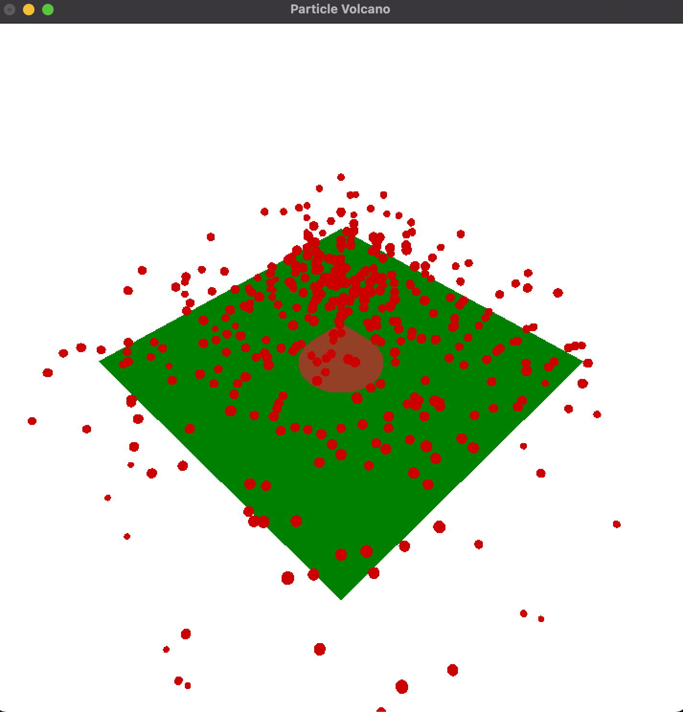

# Particle Cannon

3d particle cannon using OpenGL and C++.

**to build** 👉 g++ -framework OpenGL -framework GLUT -o cannon cannon.cpp <br>
**to run** 👉 ./cannon

## Modes 
- **Q**: Quit
- **R**: Reset
- **F**: Manual Firing
- **O**: Single Shot
- **K**: Spin
- **M**: Friction
- **L**: Lighting
- **C**: Culling
- **B**: Bouncy

```cpp


```
## Screenshots

 
